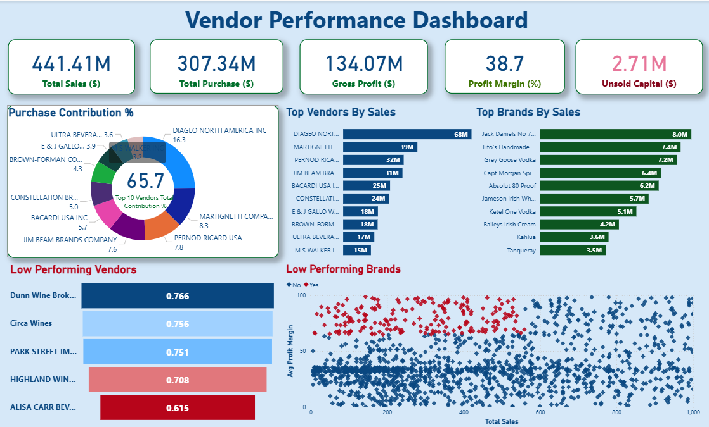

# Vendor Performance Analysis - Retail Inventory & Sales

## Overview

This project evaluates vendor performance and retail inventory dynamics to drive strategic insights for purchasing, pricing, and inventory optimization. A complete data pipeline was built using SQL for ETL, Python for analysis and hypothesis testing, and Power BI for visualization.

## Business Problem

Effective inventory and sales management are critical in the retail sector. This project aims to:
- Identify underperforming brands needing pricing or promotional adjustments
- Determine vendor contributions to sales and profits
- Analyze the cost-benefit of bulk purchasing
- Investigate inventory turnover inefficiencies
- Statistically validate differences in vendor profitability

## Tools & Technologies

- **SQL** (Common Table Expressions, Joins, Filtering)
- **Python** (Pandas, Matplotlib, Seaborn, SciPy)
- **Power BI** (Interactive Visualizations)
- **GitHub**

## Project Structure

```
vendor-performance-analysis/
├── README.md
├── requirements.txt
├── Vendor_Performance_Report.pdf
├── notebooks/                    # Jupyter notebooks
│   ├── exploratory_data_analysis.ipynb
│   └── vendor_performance_analysis.ipynb
├── scripts/                      # Python scripts for ingestion and processing
│   ├── ingestion_db.py
│   └── get_vendor_summary.py
└── dashboard/                    # Power BI dashboard file
    └── vendor_performance_dashboard.pbix
```

## Data Cleaning & Preparation

- Removed transactions with:
  - Gross Profit ≤ 0
  - Profit Margin ≤ 0
  - Sales Quantity = 0
- Created summary tables with vendor-level metrics
- Converted data types, handled outliers, merged lookup tables

## Exploratory Data Analysis (EDA)

### Negative or Zero Values Detected:
- **Gross Profit**: Min -52,002.78 (loss-making sales)
- **Profit Margin**: Min -1 (sales at zero or below cost)
- **Unsold Inventory**: Indicating slow-moving stock

### Outliers Identified:
- High Freight Costs (up to 257K)
- Large Purchase/Actual Prices

### Correlation Analysis:
- Weak between Purchase Price & Profit
- Strong between Purchase Qty & Sales Qty (0.999)
- Negative between Profit Margin & Sales Price (-0.179)

## Research Questions & Key Findings

1. **Brands for Promotions**: 198 brands with low sales but high profit margins
2. **Top Vendors**: Top 10 vendors = 65.69% of purchases → risk of over-reliance
3. **Bulk Purchasing Impact**: 72% cost savings per unit in large orders
4. **Inventory Turnover**: $2.71M worth of unsold inventory

## Vendor Profitability

- **High Vendors**: Mean Margin = 31.17%
- **Low Vendors**: Mean Margin = 41.55%
- **Hypothesis Testing**: Statistically significant difference in profit margins → distinct vendor strategies

## Dashboard

Power BI Dashboard shows:
- Vendor-wise Sales and Margins
- Inventory Turnover
- Bulk Purchase Savings
- Performance Heatmaps



## How to Run This Project

1. **Clone the repository:**
```bash
git clone https://github.com/yourusername/vendor-performance-analysis.git
```

2. **Load the CSVs and ingest into database:**
```bash
python scripts/ingestion_db.py
```

3. **Create vendor summary table:**
```bash
python scripts/get_vendor_summary.py
```

4. **Open and run notebooks:**
   - `notebooks/exploratory_data_analysis.ipynb`
   - `notebooks/vendor_performance_analysis.ipynb`

5. **Open Power BI Dashboard:**
   - `dashboard/vendor_performance_dashboard.pbix`

## Final Recommendations for Future Analysis

- Diversify vendor base to reduce risk
- Optimize bulk order strategies
- Reprice slow-moving, high-margin brands
- Clear unsold inventory strategically
- Improve marketing for underperforming vendors

---

## Contact

**Ayush Butoliya**  
Email: ayushbutoliya22@gmail.com 
